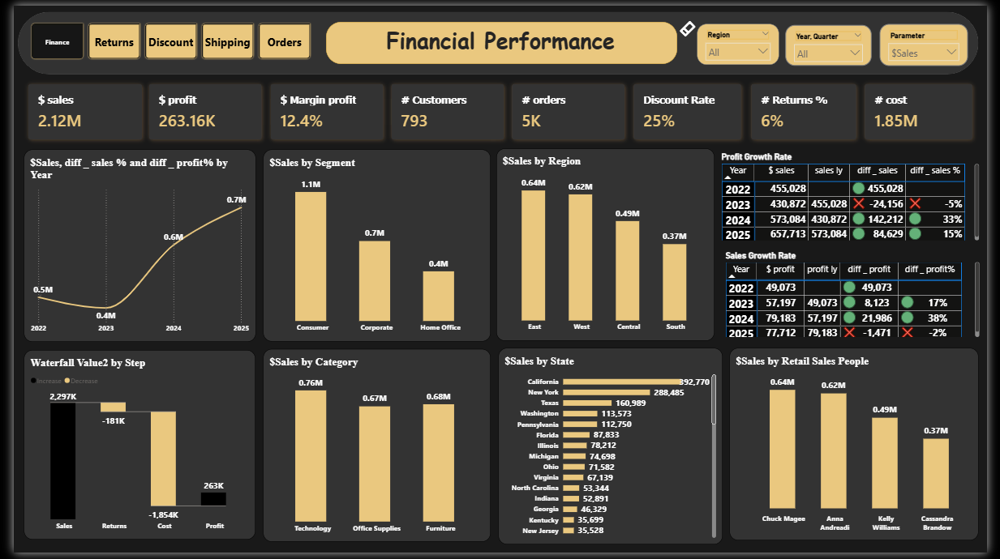
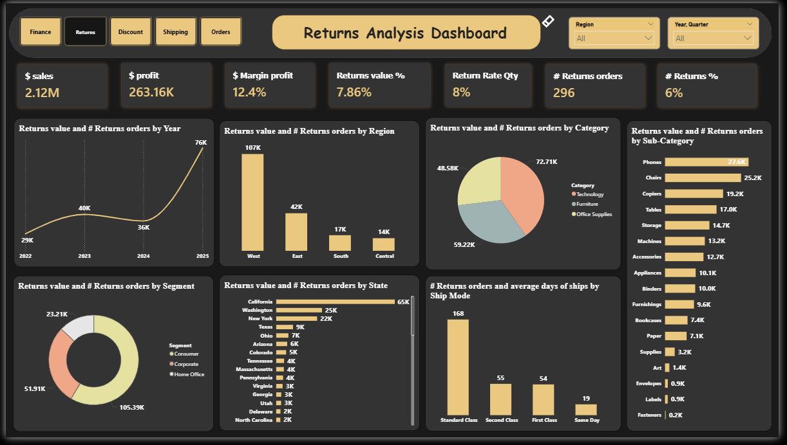
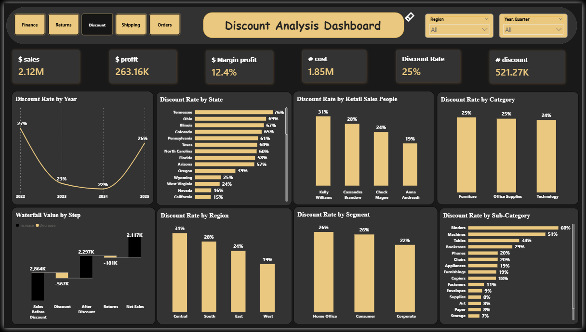
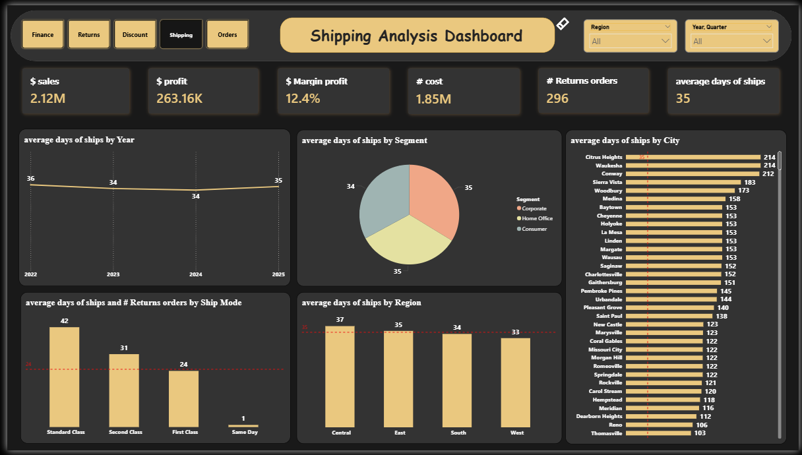
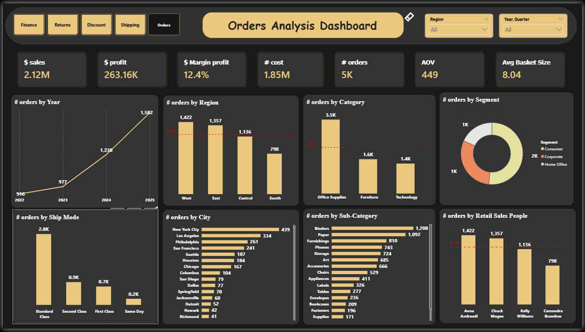

# Retail Performance Dashboard 📊

A complete end-to-end **Retail Sales Data Analysis Project** built using **Power BI** to analyze sales performance, profitability, customer behavior, shipping efficiency, and regional insights for a retail business.

This project was developed as a **graduation project** by our team to transform raw retail transaction data into interactive dashboards and business insights that support better decision-making.

---

# 📌 Project Overview

The goal of this project was to analyze retail sales operations and create a professional business intelligence dashboard that helps stakeholders:

- Monitor sales and profit performance
- Identify top-performing products and categories
- Analyze customer segments and regional performance
- Track shipping efficiency
- Understand discount impact on profitability
- Make data-driven business decisions

The dashboard provides interactive visualizations and KPIs that simplify complex retail data into meaningful insights.

---

# 📂 Dataset Description

The dataset contains retail transaction records including:

| Column | Description |
|---|---|
| Order ID | Unique order identifier |
| Order Date | Date of purchase |
| Ship Date | Shipping date |
| Ship Mode | Shipping method |
| Customer ID | Unique customer identifier |
| Customer Name | Customer full name |
| Segment | Customer segment |
| Country / City / State / Region | Geographic information |
| Product ID | Product identifier |
| Category / Sub-Category | Product classification |
| Product Name | Product details |
| Sales | Revenue generated |
| Quantity | Number of items sold |
| Discount | Applied discount |
| Profit | Profit earned |
| Cost | Product cost |
| DaysToShip | Shipping duration |

Additional calculated columns were created during data preprocessing such as:

- Amount Discount
- Sales Before Discount
- Profit Before Discount
- DaysToShip

---

# 🛠️ Tools & Technologies

- Power BI
- Power Query
- DAX
- Excel
- Data Cleaning & Transformation
- Data Visualization

---

# 📊 Dashboard Features

## Executive KPIs

- Total Sales
- Total Profit
- Profit Margin
- Total Orders
- Total Customers
- Average Shipping Time

## Sales Analysis

- Sales trends over time
- Monthly and yearly performance
- Top-selling categories and products
- Regional sales comparison

## Profitability Analysis

- Profit by category and sub-category
- Discount impact on profits
- Loss-making products identification

## Customer Insights

- Customer segmentation analysis
- Most valuable customers
- Purchasing behavior patterns

## Shipping & Operations

- Shipping duration analysis
- Ship mode performance
- Operational efficiency tracking

---

# 📈 Key Insights

Some important insights discovered during the analysis include:

- High discounts do not always increase profitability.
- Certain sub-categories generate high sales but low profits.
- The West region achieved the highest sales performance.
- Standard Class shipping was the most commonly used shipping mode.
- Some products consistently generated losses despite strong sales volume.

---

# 🧹 Data Cleaning & Preparation

The dataset went through several preprocessing steps:

- Handling missing values
- Removing duplicates
- Correcting data types
- Creating calculated columns
- Building relationships between tables
- Creating DAX measures for KPIs

---

# 🧠 DAX Measures Examples

```DAX
Total Sales = SUM(Sales[Sales])

Total Profit = SUM(Sales[Profit])

Profit Margin =
DIVIDE([Total Profit], [Total Sales], 0)

Average Shipping Days =
AVERAGE(Sales[DaysToShip])
```

---

# 📸 Dashboard Preview

> Dashboard screenshots here.

## Financial Page:



## Returns Page:



## Discounts Page:



## Shipping Page:



## Orders Page:



---

# 🚀 How to Use

1. Clone the repository:

```bash
git clone https://github.com/your-username/retail-performance-dashboard.git
```

2. Open the Power BI file:

```bash
Retail_Performance_Dashboard.pbix
```

3. Refresh the dataset if needed.

4. Explore the interactive dashboard.

---

# 📁 Project Structure

```bash
Retail-Performance-Dashboard/
│
├── Dataset/
│   └── retail_dataset.xlsx
│
├── Dashboard/
│   └── Retail_Performance_Dashboard.pbix
│
├── Images/
│   └── dashboard screenshots
│
├── Documentation/
│   └── project presentation
│
└── README.md
```

---

# 🎓 Academic Purpose

This project was developed as part of our graduation project to apply data analysis and business intelligence concepts in a real-world retail scenario.

---

# 👥 Team Members

Add your team members here:

- Mina Hanna Hanna
- Abdelfattah Kamal Mohamed
- Mohamed Ashraf Elsayed
- Walaa Mohamed Ahmed
- Abdullah Badawy Ali

---

# 🔗 Project Presentation

Presentation Link:

https://prezi.com/p/q-prwoed44pl/retail-performance-dashboard-documentation/?referral_token=BfsohVlnB3FN&utm_source=presenter_qr_code_prezi_play

---

# 🌟 Future Improvements

- Add predictive sales forecasting
- Integrate real-time data sources
- Add customer churn analysis
- Build AI-powered recommendations
- Deploy dashboard online using Power BI Service

---

# 📜 License

This project is for educational and portfolio purposes.

---

# ⭐ If you found this project useful, consider giving the repository a star!
